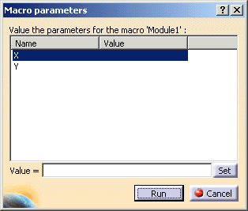
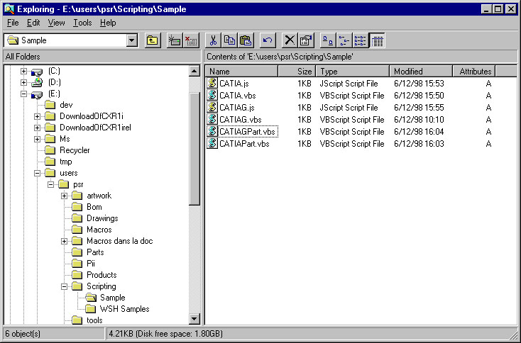

## 基础设施

### 从脚本语言调用 CATIA

访问 CATIA 对象模型可以通过不同的方式实现，具体取决于操作系统以及能够与 CATIA 共享对象的应用程序。这也适用于 ENOVIA DMU 和 DELMIA 产品。如果需要访问或启动基于 V5 平台的其他应用程序，可以将下文中的 "CATIA" 替换为 "DMU" 或 "DELMIA"。

CATIA 是 Windows 平台上的 OLE 自动化服务器，并允许在 Windows 和 UNIX 上进行宏的录制与回放。以下总结了 CATIA 的脚本编写能力。

* **在 Windows 环境下：**
* **进程内访问 (In-process)：** 使用 Visual Basic Scripting Edition (VBScript) 或 Visual Basic for Applications (VBA)，因为 CATIA 内部托管了这两种脚本引擎。
* **进程外访问 (Out-process)：** 通过以下 OLE 自动化客户端访问：
* 通过 Office 等其他应用程序的 Visual Basic for Applications。
* Visual Basic 6 开发工作室 (Development Studio)。
* Windows 脚本宿主 (WSH) 以及 VBScript 或 JScript 等语言。
* HTML 页面。

* **在 UNIX 环境下：**
* **进程内访问：** 使用 Visual Basic Scripting Edition。

从“工具”菜单和“录制宏”对话框录制的宏可以使用：

* **VBScript** 语言。
* **VBA** 语言。
* **CATScript** 语言。这种 CATIA 特有的语言旨在保持 Unix Basic Script 引擎与 Windows VBScript 引擎之间的兼容性。由于自 V5R7 以来 CATIA 不再在 Unix 上托管 Basic Script 引擎，因此保留该语言仅用于兼容性目的。实际上，它在移除类型信息后由 VBScript 引擎处理。

**进程内访问**意味着脚本的解释执行在与 CATIA 相同的进程中进行。通常，您通过交互式的 **工具 -> 宏 (Tools->Macros)** 命令触发宏窗口来运行宏。在这种情况下，宏被 CATIA 视为普通命令处理。

**进程外访问**意味着您从运行在另一个进程中的其他应用程序运行宏。在这种情况下，宏必须首先连接到 CATIA 才能访问其数据。如果当前没有运行中的 CATIA 进程，此连接操作将启动 CATIA。

---

### 运行进程内宏 (In-process Macros)

进程内访问使用 CATIA 托管的脚本引擎。您可以在 UNIX 和 Windows 上运行此类宏，共有三种方式：

1. **从宏窗口运行：**
通常通过 **工具 -> 宏 (Tools->Macros)** 运行。宏像普通命令一样被处理。
注意，您可以为 `CATMain` 函数添加参数：
```vb
Sub CATMain(X, Y)
  ' 这里我们期望 X 是标量，Y 是对象
  MsgBox X & TypeName(Y)
End Sub

```

启动此类宏时，会弹出一个对话框请求为参数赋值。建议为变量取明确的名称（如 `iThisNumber`, `oThatObject`）以避免用户错误。


2. **启动时运行 (-macro)：**
可以使用 `-macro` 选项让 CATIA 在启动后立即执行宏：
`CNEXT -macro E:\Users\Macros\MacroToRun.CATScript`
宏也可以存储在 `catvba` 或 `CATPart`/`CATProduct` 等文档中：
`CNEXT -macro myDocument.catvba myMacro`
`CNEXT -macro myDocument.CATPart myMacro`
以此方式启动的 CATIA 会话在宏结束后将保持活动状态，除非在代码中使用 `CATIA.Quit` 明确退出。
3. **批处理运行 (-batch -macro)：**
使用批处理模式运行宏：
`CNEXT -batch -macro E:\Users\Macros\BatchMacro.CATScript`
这通常会因为禁用了界面刷新而提高性能。宏执行完毕后，CATIA 会话会自动关闭。

---

### 运行进程外宏 (Out-process Macros)

进程外访问是指从另一个进程（如 Excel/Word 的 VBA 或 VB6）运行宏。您还可以通过 Windows 脚本宿主 (WSH) 运行 VBScript 或 JScript，或者嵌入 HTML 页面。此类操作仅限 Windows。

#### 从 VB6 或 VBA 运行

* **如果 CATIA 已经在运行：** 使用 `GetObject` 连接。

```vb
    Dim CATIA As Object
    Set CATIA = GetObject(, "CATIA.Application")
    ```
*   **如果 CATIA 未在运行：** 使用 `CreateObject` 启动。
    ```vb
    Dim CATIA As Object
    Set CATIA = CreateObject("CATIA.Application")
```

#### 使用 Windows 脚本宿主 (WSH) 运行
WSH 允许脚本直接从桌面、资源管理器或命令行运行。
在 Visual Basic 中，脚本应以连接 CATIA 开始：
```vb
Dim CATIA
Set CATIA = WScript.CreateObject("CATIA.Application")
' 或者
Set CATIA = WScript.GetObject("", "CATIA.Application")

```

双击 `.vbs` 文件即可运行，或在控制台使用 `cscript` 命令：
`cscript e:\users\psr\Scripting\Sample\CATIA.vbs`

#### 从动态 HTML 页面运行

您可以将 VBScript 嵌入 HTML 页面。嵌入方式包括：

1. 使用 `<script>` 标签并在页面加载时运行。
2. 由表单 (Form)、输入框 (Input) 或锚点 (Anchor) 标签引用。
3. 作为超链接运行（仅限 JScript，但 JScript 可以调用 VBScript 函数）。

