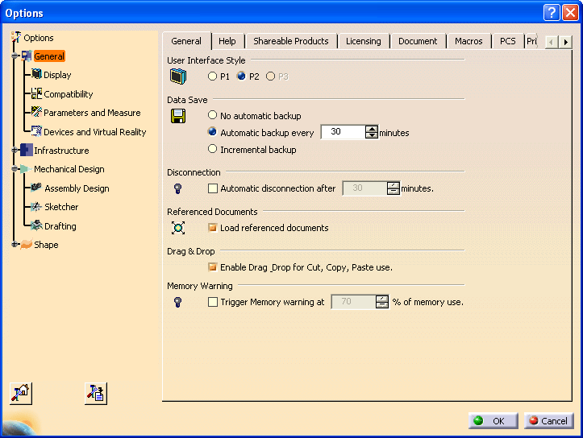
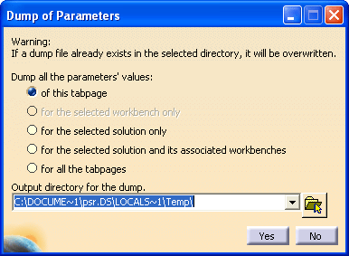
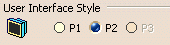

## 基础结构 (Infrastructure)
### 通过自动化管理设置 (Administrating Settings with Automation)

#### 摘要
除了使用 工具 -> 选项... (Tools->Options...) 命令外，得益于“设置控制器对象 (Setting Controller Objects)”，许多设置都可以通过自动化（Automation）进行管理和行政维护。这使您能够记录当前设置、修改设置值或锁定您认为合适的选项。您可以在运行宏的过程中应用这些自定义设置，而无需手动进入每一个对应的属性页。

#### 自动化如何帮助您管理和维护设置
设置控制器负责管理存储在 .CATSettings 文件中的设置库。
设置控制器接口 vs. 属性页
工具 -> 选项... 对话框的左侧显示了一个树状结构：
-第一级节点：代表解决方案（Solutions），如：常规 (General)、基础结构 (Infrastructure)、机械设计 (Mechanical Design) 等。
-第二级节点：代表工作台（Workbenches），如：显示 (Display)、兼容性 (Compatibility)、参数与测量 (Parameters and Measure) 等。
-属性页 (Property Page)：每个工作台通常关联一个或多个属性页（以标签页形式呈现）。

#### 为属性页创建宏
在 工具 -> 选项... 对话框的左下角有一个 转储 (Dump) 按钮 ![dump button]，用于将设置导出为 .catvbs 脚本宏文件。

点击该按钮后，您可以选择导出范围：


-当前属性页：仅为当前页面创建一个宏。
-选定工作台：为该工作台下的所有属性页创建一系列宏。
-选定解决方案：为该解决方案下的所有属性页创建一系列宏。
-所有属性页：为所有解决方案及工作台下的属性页创建完整的宏集合。
注意：只有部分属性页支持此功能。对于不支持的页面，转储命令将生成一个空宏。

#### 理解生成的宏
在 Windows 系统中，宏文件默认存储在 C:\Documents and Settings\user\Local Settings\Temp 目录下。它们的命名遵循“解决方案-工作台-属性页”的规则，中间以短横线（-）分隔。如果名称中出现空格，则会用下划线（_）代替。

例如：

位于 General（常规）解决方案中的 General 属性页生成的宏命名为：General-General.catvbs。

位于 General 解决方案下 Display（显示）工作台中的 Tree Appearance（树状结构外观）属性页生成的宏命名为：General-Display-Tree_Appearance.catvbs。

#### 解析生成的宏
以 General 解决方案的 General 属性页生成的宏文件为例。该宏以以下语句开头：
Language="VBSCRIPT"

Sub CATMain()

Set settingControllers1 = CATIA.SettingControllers

Set generalSessionSettingAtt1 = settingControllers1.Item("CATCafGeneralSessionSettingCtrl")

首先获取的是 SettingControllers 集合对象，并将其存入 settingControllers1 变量中。由于设置控制器集合是聚合在 Application（应用程序）对象下的，因此直接调用 CATIA.SettingControllers 即可返回该集合。

设置控制器集合包含了所有可用的设置控制器对象。每个设置控制器负责管理存储在 .CATSettings 文件中的设置仓库。通过设置控制器，您可以：

对设置仓库中的数值进行读写访问。

检索设置的相关信息（如默认值、是否被锁定）。

执行锁定或解锁操作。

接下来的代码通过 Item 方法从集合中获取特定的设置控制器，并存入 generalSessionSettingAtt1 变量。这里传入的参数是设置控制器的标识符 "CATCafGeneralSessionSettingCtrl"。

小贴士： 变量名是由“转储（Dump）”命令根据设置控制器对象名称生成的（首字母转为小写，并在末尾添加数字）。因此，您可以轻松地从标识符 generalSessionSettingAtt1 推断出对象名称为 GeneralSessionSettingAtt。

需要注意的是，同一个属性页中显示的设置可能属于不同的设置仓库，因此可能由不同的设置控制器来管理。

#### 获取具体设置项
宏的后续代码如下：

Dim long1
long1 = generalSessionSettingAtt1.UIStyle
'--------------------------------------------------
' Returned value : (CATGenUIStyle) UIStyleP2
'--------------------------------------------------
例如： UIStyleP2 对应枚举值 1。


这段代码处理的是位于 General 属性页顶部的 User Interface Style（用户界面样式）设置。

该设置以长整数（Long Integer）形式存储，其当前值返回到根据设置类型命名的 `long1` 变量中。该设置通过 `GeneralSessionSettingAtt` 对象的 `UIStyle` 属性进行管理。此属性允许你获取设置值（如上述宏所示）或对其进行设置。

以单引号字符开头的注释显示了该设置的当前值：`UIStyleP2`。该值必须从括号内显示的 `CATGenUIStyle` 枚举中选择。请注意，枚举包含一组离散的值，可以防止返回或设置超出范围的值。每个值都是一个整数，第一个值从 0 开始，第二个为 1，依此类推。使用枚举有助于赋予这些数值具体的含义。在 `CATGenUIStyle` 中：

* 值 **0** 对应字符串 `UIStyleP1`
* 值 **1** 对应字符串 `UIStyleP2`
* 值 **2** 对应字符串 `UIStyleP3`

显然，使用 `UIStyleP2` 比单纯的数字 `1` 更有意义。

接下来的代码行提供了有关此设置的其他信息：

```vb
Dim bSTR1
bSTR1 = ""
Dim bSTR2
bSTR2 = ""
Dim boolean1
boolean1 = generalSessionSettingAtt1.GetUIStyleInfo(bSTR1, bSTR2)
'--------------------------------------------------
' Parameter 1 : (String) "Default value"
' Parameter 2 : (String) "Unlocked"
' Returned value : (Boolean) False
'--------------------------------------------------

```

这些行使用了 `GetUIStyleInfo` 方法，该方法检索注释中显示的以下信息：

* **第一个参数**是一个字符串。其类型为 `CATBSTR`（体现在变量名 `bSTR1` 中）。此参数指示该设置值是否为默认值。在上述示例中，它是默认值，因此显示字符串 `"Default value"`。否则，如果该值被管理员更改，则会显示 `"Set at Admin Level n"`（n 为发生更改的管理层级）。
* **第二个参数**也是名为 `bSTR2` 的字符串。它指示设置是否被锁定。在示例中，值 `"Unlocked"` 表示设置未锁定。否则，如果被管理员锁定，则会显示 `"Locked at Admin Level n"`。如果锁定层级与当前使用 Dump 命令的层级相同，则仅返回 `"Locked"`。
* **返回值 (`boolean1`)** 表示在当前管理层级下，该设置值是否被修改或锁定。如果是，返回 `True`；否则为 `False`。

该方法的名称是由设置参数名 `UIStyle` 加上前缀 `Get` 和后缀 `Info` 构成的。这种命名规则适用于所有通过 Automation 对象管理的设置参数。你可以参考 `SettingController` 对象以了解有关此方法的更多信息。

在宏的后续部分，出现了以下代码：

```vb
Dim boolean2
boolean2 = generalSessionSettingAtt1.DragDrop
'--------------------------------------------------
' Returned value : (Boolean) False
'--------------------------------------------------

Dim bSTR3
bSTR3 = ""
Dim bSTR4
bSTR4 = ""
Dim boolean3
boolean3 = generalSessionSettingAtt1.GetDragDropInfo(bSTR3, bSTR4)
'--------------------------------------------------
' Parameter 1 : (String) "Default value"
' Parameter 2 : (String) "Unlocked"
' Returned value : (Boolean) True
'--------------------------------------------------

```

这些代码处理的是 **Drag & Drop（拖放）** 设置。尽管它在对话框底部显示，但它由同一个设置控制器对象管理，因为宏使用了相同的变量 `generalSessionSettingAtt1`。请注意，不同的变量名仍使用带有递增索引的变量类型。

`DragDrop` 属性返回或设置是否启用剪切、复制或粘贴操作的拖放功能。这是一个布尔值：勾选复选框时为 `True`（启用），未勾选时为 `False`（禁用）。

随后，宏包含以下行：

```vb
Set disconnectionSettingAtt1 = settingControllers1.Item("CATSysDisconnectionSettingCtrl")

Dim boolean4
boolean4 = disconnectionSettingAtt1.ActivationState
'--------------------------------------------------
' Returned value : (Boolean) False
'--------------------------------------------------

Dim bSTR5
bSTR5 = ""
Dim bSTR6
bSTR6 = ""
Dim boolean5
boolean5 = disconnectionSettingAtt1.GetActivationStateInfo(bSTR5, bSTR6)
'--------------------------------------------------
' Parameter 1 : (String) "Default value"
' Parameter 2 : (String) "Unlocked"
' Returned value : (Boolean) False
'--------------------------------------------------

```

这里从设置控制器集合对象中返回了一个新的设置控制器：`DisconnectionSettingAtt` 对象。这是因为 **Disconnection（断开连接）** 设置由该对象管理，而不是之前的 `GeneralSessionSettingAtt`，即使这两个设置位于同一个对话框中。

`boolean4` 变量指示是否应发生断开连接：`True` 对应对话框中勾选的状态。`GetActivationStateInfo` 方法的参数含义与前述 `GetUIStyleInfo` 相同。

接下来是：

```vb
Dim long2
long2 = disconnectionSettingAtt1.InactivityDuration
'--------------------------------------------------
' Returned value : (Long) 1800
'--------------------------------------------------

Dim bSTR7
bSTR7 = ""
Dim bSTR8
bSTR8 = ""
Dim boolean6
boolean6 = disconnectionSettingAtt1.GetInactivityDurationInfo(bSTR7, bSTR8)
'--------------------------------------------------
' Parameter 1 : (String) "Default value"
' Parameter 2 : (String) "Unlocked"
' Returned value : (Boolean) False
'--------------------------------------------------

```

此设置包含应用程序断开连接前的**不活动时长**。仅当前面的设置被勾选时才有意义。请注意，对话框中显示的值（30）以**分钟**为单位，但设置库中存储和返回的值（1800）以**秒**为单位。你可能会发现 UI 显示与应用程序实际管理的值之间存在此类差异。

宏还在继续，但你现在应该已经掌握了足够的信息来理解剩余部分。你会发现剩余部分仅处理 **Memory Warning（内存警告）** 设置。这意味着该对话框中显示的其他设置**不通过任何设置控制器对象管理**。这些设置包括：

* Data Save（数据保存）
* Referenced Documents（参考文档）
* Conferencing（会议）

**使用宏管理设置不适用于这些设置。**

---

#### 使用创建的宏管理设置

如果你尝试直接运行生成的宏，你除了得到注释中记录的内容外，不会有任何实际操作。你可以重用并修改此宏以执行以下操作：

1. 检索设置信息
2. 设置新值
3. 锁定设置

##### 检索设置信息

假设你想获取“用户界面样式（User Interface Style）”的信息。你可以直接复用宏的相关部分，并将信息显示在弹窗中。

```vb
Option Explicit
Sub CATMain()

' 检索设置控制器
Set settingControllers1 = CATIA.SettingControllers
Set generalSessionSettingAtt1 = settingControllers1.Item("CATCafGeneralSessionSettingCtrl")

' 获取值和信息
Dim long1
long1 = generalSessionSessionSettingAtt1.UIStyle

Dim bSTR1
bSTR1 = ""
Dim bSTR2
bSTR2 = ""
Dim boolean1
boolean1 = generalSessionSettingAtt1.GetUIStyleInfo(bSTR1, bSTR2)

' 在弹窗中显示
msgbox "User Interface Style" & Chr(13) & _
       "  Value: " & long1 & Chr(13) & _
       "  Default Value: " & bSTR1 & Chr(13) & _
       "  Lock Value: " & bSTR2 & Chr(13) & _
       "  Locked or modified at this level: " & boolean1

End Sub

```

*注：弹窗中显示的整数 `1` 对应枚举 `CATGenUIStyle` 的第二个值 `UIStyleP2`。*

#####  设置新值

假设你想将样式设置为 P1。

```vb
Language="VBSCRIPT"
Sub CATMain()

Set settingControllers1 = CATIA.SettingControllers
Set generalSessionSettingAtt1 = settingControllers1.Item("CATCafGeneralSessionSettingCtrl")

' 设置新值 UIStyleP1
Dim myNewStyle
myNewStyle = CATGenUIStyle.UIStyleP1
generalSessionSettingAtt1.UIStyle = myNewStyle

' 必须保存更改
generalSessionSettingAtt1.SaveRepository

End Sub

```

##### 锁定设置

锁定方法不在生成的宏中直接显示，其名称由参数名 `UIStyle` 加上前缀 `Set` 和后缀 `Lock` 构成。

```vb
Language="VBSCRIPT"
Sub CATMain()

Set settingControllers1 = CATIA.SettingControllers
Set generalSessionSettingAtt1 = settingControllers1.Item("CATCafGeneralSessionSettingCtrl")

' 锁定设置
generalSessionSettingAtt1.SetUIStyleLock True

' 保存更改
generalSessionSettingAtt1.SaveRepository

End Sub

```

*注：由于涉及锁定操作，必须在**管理模式 (Admin Mode)** 下启动应用程序，否则宏会失败。*

---

### 使用宏管理设置的建议

通过 Automation 管理设置可以大大简化管理工作：

* **备份默认状态**：在新版本安装后，点击所有属性页面的 **Dump** 按钮，将生成的 `.catvbs` 文件存入“标准/默认”文件夹。
* **实施自定义**：修改这些宏以设置特定值或锁定状态。
* **版本迁移与对比**：安装新版本后，再次执行 Dump 并使用 `diff` 或 `windiff` 工具与旧版本对比。这能让你迅速发现新版本中新增了哪些可管理的设置，从而决定是否需要更新你的自定义脚本。

**简而言之：** 自动化管理让你可以记录默认值、应用自定义修改并跟踪版本间的差异，使设置的管理工作变得清晰且高效。