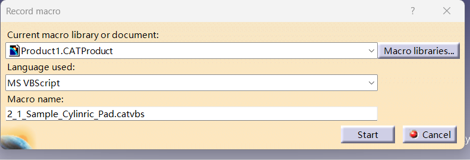
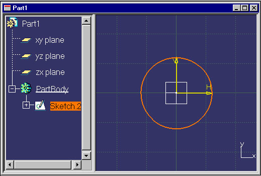
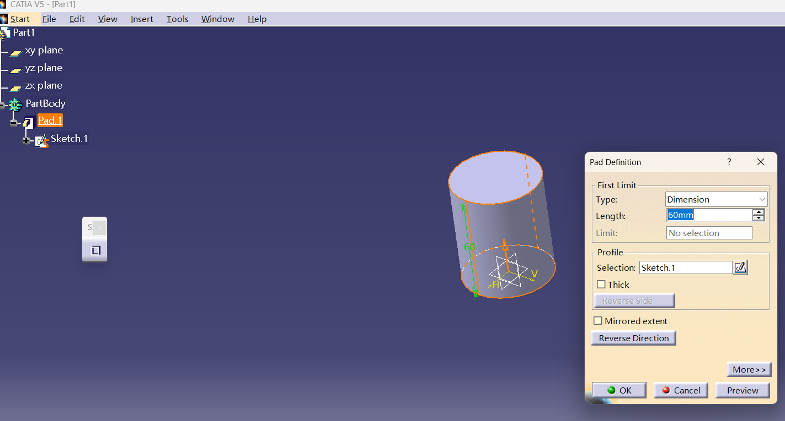
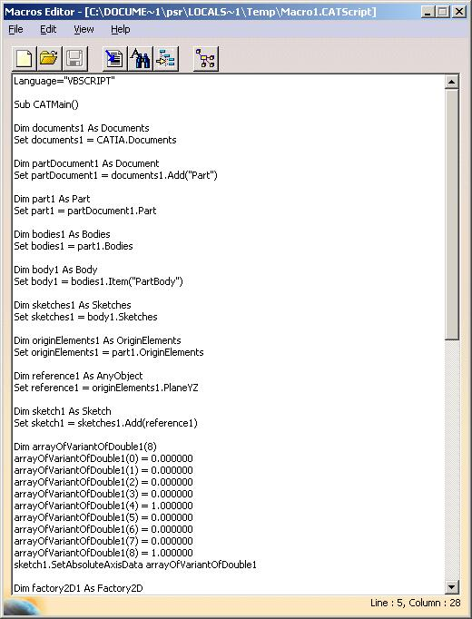
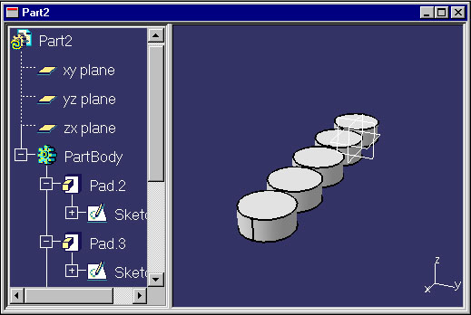
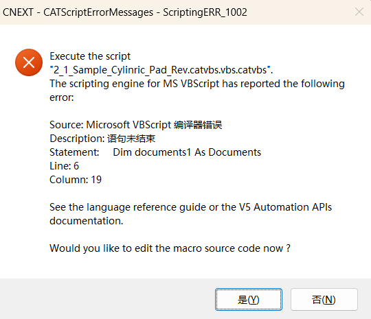

## 基础设施

### 自动化入门

本文将向您介绍如何使用脚本语言访问 CAA V5 自动化对象，以捕捉您的专业知识并提高生产效率。您可以自定义 V5 应用程序来自动执行重复性任务，并使其适应您自己的流程。

CATIA 和 DELMIA 应用程序的产品共享相同的对象模型，通过 Windows 上的 Visual Basic 脚本和 UNIX 上的 Basic Script 脚本，可以访问这些模型及其自身的对象。

您可以从头开始编写脚本，也可以使用 **工具 (Tools)** 菜单中 **宏 (Macros)...** 命令提供的录制功能。该功能可以记录最终用户的操作场景并生成脚本，您可以直接使用或进行修改。

> **注意：** 并非所有工作台都支持录制宏。

我们在这里提供了一个简单的脚本示例，旨在展示什么是脚本、脚本编写的不同步骤、简要介绍脚本环境和对话窗口以及什么是日志记录（Journaling）。本示例分为以下几个部分：

1. **录制场景**：我们将录制一个圆柱形凸台（Pad）的创建过程。
2. **理解录制好的宏**：我们将解释生成的录制宏的内容。
3. **修改生成的宏**：我们将修改生成的宏，以创建五个类似的凸台。
4. **回放修改后的宏**。

随后，您可以在“从脚本语言调用 CATIA”部分找到有关脚本语言、环境的信息，以及为不熟悉宏编写的用户提供的关键信息。

---

#### 1 - 录制场景

此场景在草图中创建一个圆，并使用该草图创建一个圆柱形凸台。
录制的宏存储在文件中，而不是文档中。

1. 选择 **工具 -> 宏 -> 开始录制... (Tools->Macro->Start Recording ...)** 命令，显示“录制宏”对话框。
2. 系统提供了一个默认的宏库。宏库是存储宏的地方，可以是文件夹、VBA 项目或文档。
3. 根据库的不同，您可以选择不同的录制语言。选择 **CATScript** 以获得与下文类似的结果。
4. 点击“录制宏”对话框中的 **开始 (Start)** 开始录制。此时会出现 **停止录制 (Stop Recording)** 对话框。

5. 在 **文件 (File)** 菜单中，点击 **新建 (New)**，或点击图标并双击 **Part** 来创建一个新零件。随后会创建一个新零件并打开其窗口。
6. 在规格树中选择 **xy 平面**，然后选择 **草图 (sketcher)** 图标创建一个草图。
7. 在草图工具栏中，选择 **圆 (circle)** 图标，点击两次以依次确定圆心和圆周上的点。

8. 点击 **退出草图 (sketcher exit)** 图标。
9. 选择 **凸台 (pad)** 图标，在草图上创建一个凸台。
10. 在“凸台定义”对话框中，选择长度为 **20 mm**，然后点击 **确定 (OK)**。凸台创建完成。

11. 点击 **停止录制** 对话框中的停止按钮，或选择 **工具 -> 宏 -> 停止录制** 命令。您的宏现在已存储在您选择的文件中。

---

#### 2 - 理解录制好的宏

下面我们按照交互步骤逐行详细解释录制的内容。
选择 **工具 -> 宏 ** 命令，可以查看刚才生成的宏。
开始录制宏会创建宏文件并生成第一条指令，声明所使用的脚本语言和宏入口点 `CATMain` 子程序：

```vb
Language="VBSCRIPT"
Sub CATMain()

```

执行新建 Part 操作会生成以下指令：

```vb
Dim documents1 As Documents
Set documents1 = CATIA.Documents

Dim partDocument1 As Document
Set partDocument1 = documents1.Add("Part")

```

创建了一个 Part 类型的文档。为此，该文档被添加到 CATIA 应用程序的 `Documents` 集合中。

选择 xy 平面并点击草图图标：

```vb
Dim part1 As Part
Set part1 = partDocument1.Part
Dim bodies1 As Bodies
Set bodies1 = part1.Bodies
Dim body1 As Body
Set body1 = bodies1.Item("PartBody")

Dim sketches1 As Sketches
Set sketches1 = body1.Sketches
Dim originElements1 As OriginElements
Set originElements1 = part1.OriginElements
Dim reference1 As AnyObject
Set reference1 = originElements1.PlaneXY
Dim sketch1 As Sketch
Set sketch1 = sketches1.Add(reference1)
Dim arrayOfVariantOfDouble1(8)
arrayOfVariantOfDouble1(0) = 0.000000
arrayOfVariantOfDouble1(1) = 0.000000
arrayOfVariantOfDouble1(2) = 0.000000
arrayOfVariantOfDouble1(3) = 1.000000
arrayOfVariantOfDouble1(4) = 0.000000
arrayOfVariantOfDouble1(5) = 0.000000
arrayOfVariantOfDouble1(6) = 0.000000
arrayOfVariantOfDouble1(7) = 1.000000
arrayOfVariantOfDouble1(8) = 0.000000
sketch1.SetAbsoluteAxisData arrayOfVariantOfDouble1
Dim factory2D1 As Factory2D
Set factory2D1 = sketch1.OpenEdition()

```

一个名为 `Sketch1` 的 `Sketch` 对象被添加到 `Sketches` 集合中，使用对应于 XY 平面的 `reference1` 作为支撑面。`SetAbsoluteAxisData` 方法用于定义草图轴的方向。通过对创建的草图打开草图编辑器，创建了一个 `Factory2D` 对象，该对象具有创建 2D 对象的方法。

```vb
Dim geometricElements1 As GeometricElements
Set geometricElements1 = sketch1.GeometricElements
Dim axis2D1 As GeometricElement
Set axis2D1 = geometricElements1.Item("AbsoluteAxis")
Dim line2D1 As AnyObject
Set line2D1 = axis2D1.GetItem("HDirection")

line2D1.ReportName = 1
Dim line2D2 As AnyObject
Set line2D2 = axis2D1.GetItem("VDirection")

line2D2.ReportName = 2

```

草图创建时会自动创建一个轴。这两条线被赋予了 `ReportName` 属性标识符，供 3D 建模服务在草图内部检索这些元素。

创建圆：

```vb
Dim circle2D1 As Circle2D
Set circle2D1 = factory2D1.CreateClosedCircle(0.000000, 0.000000, 25.000000)
Dim point2D1 As AnyObject
Set point2D1 = axis2D1.GetItem("Origin")

circle2D1.CenterPoint = point2D1
circle2D1.ReportName = 3

```

使用 `CreateClosedCircle` 创建圆，初始半径为 25mm，然后通过 `CenterPoint` 属性将其约束在坐标原点。

退出草图并更新零件：

```vb
    sketch1.CloseEdition
    part1.Update 

```

创建凸台：

```vb
    Dim shapeFactory1 As Factory
    Set shapeFactory1 = part1.ShapeFactory
    
    Dim pad1 As Pad
    Set pad1 = shapeFactory1.AddNewPad(sketch1, 60.000000)
    
    part1.Update  

```

使用 `AddNewPad` 方法创建长度为 60mm 的凸台。

---

#### 3 - 修改生成的宏

本任务说明如何修改生成的宏，使其循环创建五个相同的圆柱形凸台。

1. 选择 **工具 -> 宏 -> 宏...** 命令显示“宏”对话框。
2. 选择宏名称并点击 **编辑 (Edit)**。
3. 您可以使用自定义文本编辑器，通过设置环境变量 `CATMacroEditor` 来实现（如 `set CATMacroEditor=NOTEPAD`）。或者 or using 控制面板 Control Panel/System/Environment on Windows, or:

   export CATMacroEditor=vi



修改后的代码（加粗部分为新增或修改内容）：

```vb
Language="VBSCRIPT"
' My macro creates five cylinders
Sub CATMain()
...
Dim refer1 As AnyObject
Set refer1 = originElements1.PlaneXY
x = 0

Dim arrayOfVariantOfDouble1(8)
arrayOfVariantOfDouble1(0) = 0.000000
...
arrayOfVariantOfDouble1(8) = 0.000000

For I = 1 To 5

  Dim sketch1 As Sketch
  Set sketch1 = sketches1.Add(refer1)
  ...
  Dim circle2D1 As Circle2D
  Set circle2D1 =                   _
     factory2D1.CreateClosedCircle( _
                          x,        _
                          0.000000, _
                          10.000000)

  circle2D1.ReportName = 3
  ...
  part1.Update 

  x = x + 25
Next
End Sub  

```

**修改要点：**

* 初始化变量 `x` 以改变草图位置。
* 使用 `For...Next` 创建循环。
* 将不变化的数组声明移出循环。
* 每次循环将 `x` 增加 25mm。

---

#### 4 - 运行宏

退出宏编辑器回到“宏”窗口，点击 **运行 (Run)**。结果将自动在 CATIA 中生成五个间隔排列的圆柱体。



---

#### 总结

本案例展示了如何录制宏、对其进行修改并最终执行。


#### 避坑
官方代码有问题，无法运行。

-重复使用同一个草图创建多个凸台（Pad）：
在您的 For 循环中，您每次都打开 sketch1 进行修改（画圆），然后基于 sketch1 创建一个 pad1。
问题在于： 在 CATIA 中，一个凸台（Pad）特征通常只能引用一个唯一的草图。当循环到第二次时，您修改了 sketch1 里的圆，原本的第一个凸台也会跟着变（或者报错），而且程序会尝试基于同一个草图创建第二个、第三个凸台。这在 CATIA 的拓扑结构中是不合规的，会导致宏崩溃或结果混乱。

坐标偏置的逻辑：
您在 CreateClosedCircle 中使用了变量 x，但随后又将圆心约束到了 Origin（坐标原点）。这意味着无论 x 是多少，圆心永远被拉回 (0,0)。
为了实现创建 5 个不重合的圆柱体，我们需要在循环内部每次都创建一个新草图。

```
Language="VBSCRIPT"

Sub CATMain()

    ' 获取文档对象
    Dim documents1 As Documents
    Set documents1 = CATIA.Documents

    ' 新建零件
    Dim partDocument1 As PartDocument
    Set partDocument1 = documents1.Add("Part")

    Dim part1 As Part
    Set part1 = partDocument1.Part

    Dim body1 As Body
    Set body1 = part1.Bodies.Item("PartBody")

    Dim sketches1 As Sketches
    Set sketches1 = body1.Sketches 

    Dim originElements1 As OriginElements
    Set originElements1 = part1.OriginElements

    ' 参考平面
    Dim reference1 As AnyObject
    Set reference1 = originElements1.PlaneXY

    ' 定义坐标数据数组（移出循环以提高效率）
    Dim arrayOfVariantOfDouble1(8)
    arrayOfVariantOfDouble1(0) = 0.000000
    arrayOfVariantOfDouble1(1) = 0.000000
    arrayOfVariantOfDouble1(2) = 0.000000
    arrayOfVariantOfDouble1(3) = 1.000000
    arrayOfVariantOfDouble1(4) = 0.000000
    arrayOfVariantOfDouble1(5) = 0.000000
    arrayOfVariantOfDouble1(6) = 0.000000
    arrayOfVariantOfDouble1(7) = 1.000000
    arrayOfVariantOfDouble1(8) = 0.000000

    Dim x
    x = 0

    ' --- 开始循环 ---
    For I = 1 To 5
        
        ' 关键修正：每次循环创建一个新的草图对象
        Dim currentSketch As Sketch
        Set currentSketch = sketches1.Add(reference1)
        
        currentSketch.SetAbsoluteAxisData arrayOfVariantOfDouble1
        
        ' 进入草图编辑模式
        Dim factory2D1 As Factory2D
        Set factory2D1 = currentSketch.OpenEdition()

        ' 创建圆：圆心坐标随 x 变化。
        ' 注意：不要再把 CenterPoint 约束到原点，否则 x 的变化会失效。
        Dim circle2D1 As Circle2D
        Set circle2D1 = factory2D1.CreateClosedCircle(x, 0.000000, 10.000000)

        ' 退出草图编辑
        currentSketch.CloseEdition()

        ' 更新零件
        part1.Update 

        ' 创建凸台特征
        Dim shapeFactory1 As ShapeFactory
        Set shapeFactory1 = part1.ShapeFactory
        
        Dim pad1 As Pad
        Set pad1 = shapeFactory1.AddNewPad(currentSketch, 60.000000)

        part1.Update 

        ' 偏置 X 坐标
        x = x + 25
    Next
    ' --- 循环结束 ---

End Sub

```

-报错代码未结束
在纯 VBScript 语言中（.catvbs 或 .vbs），不支持显式声明变量的类型。VBScript 是弱类型语言，所有的变量都只能声明为变体类型（Variant）。遇到 As Documents 这样的强类型声明时，VBScript 编译器无法识别，因此报出“语句未结束”的错误。
修改文件扩展名为 .CATScript
CATIA 内部对 .CATScript 文件做了特殊处理。当它运行 .CATScript 时，会自动在后台把所有的 As xxx 类型声明抹除掉，然后再交给底层的 VBScript 引擎去执行。这样既能在写代码时保留类型提示，又不会引发编译器错误。

#### 代码改进说明
-移动 Set sketch1 = sketches1.Add(reference1) 到循环体内：
这样每次循环都会生成 Sketch.1, Sketch.2 等。每个 Pad 都有自己独立的草图支撑。

删除了 circle2D1.CenterPoint = point2D1：
-在录制宏时，CATIA 经常会自动添加约束。但在自动化脚本中，如果你已经在 CreateClosedCircle(x, 0, radius) 中指定了坐标，再添加原点约束会强行覆盖你的 x 变量。

-变量声明与类型：
虽然 VBScript 是弱类型的，但在处理 CATIA 对象时，明确 Set 对象的逻辑顺序非常重要。

-间距调整：
我将圆的半径改为了 10（原代码是 25），而 x 的增量是 25。如果半径是 25，圆柱体之间会切点接触；如果半径是 10，它们之间会有明显的间隙，方便你观察效果。

代码见文件夹和官方的信息：
[官方代码] https://catiadesign.org/_doc/V5Automation/online/CAAScdInfUseCases/CAAInfGettingStartedSource.htm