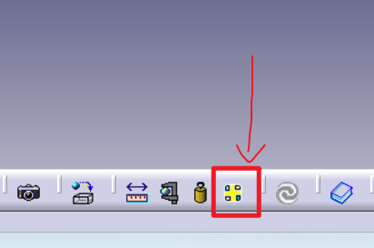

## 基础设施

### 将宏作为命令添加到工具栏

您可以通过添加图标来触发您喜爱的宏，从而轻松自定义您的工具栏。这能有效减少您调用常用宏的访问时间。

本任务旨在说明如何将宏作为命令添加到工具栏中。

1. 选择 **工具 -> 宏 -> 宏... (Tools->Macro->Macros...)** 命令以显示“宏”对话框，然后选择您想要添加的宏，以确保包含该宏的文件的目录路径已与 CATIA 识别的路径相连接。然后点击 **取消 (Cancel)**。
2. 选择 **工具 -> 自定义... (Tools->Customize)**，然后选择 **命令 (Commands)** 选项卡，并在左侧列表中选择 **宏 (Macros)**。将宏名称拖动到您希望放置的工具栏中。此时将使用默认图标。
3. 若要选择非默认图标，请点击 **显示属性 (Show Properties)**，并通过点击相应的图标按钮来浏览当前使用的图标。选择合适的图标后，再将宏名称拖动过去。
4. 您也可以通过点击相应的图标按钮来使用图标浏览器 (Icon Browser)。
自制图标失效，应该是22*22或者16*16大小的位图，而且需要catia中文界面。

