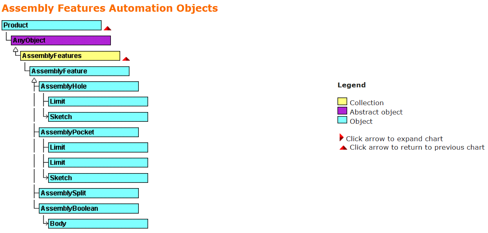

`Product` 对象的 `GetTechnologicalObject` 方法允许检索聚合了不同 `AssemblyFeature`（装配特征）对象的 `AssemblyFeatures` 集合：

```vb
Dim assemblyFeatures1 As AnyObject
Set assemblyFeatures1 = product1.GetTechnologicalObject("AssemblyFeatures")

```