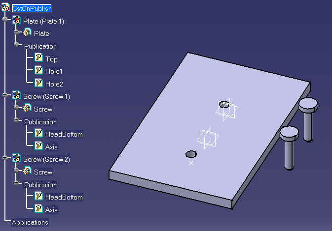
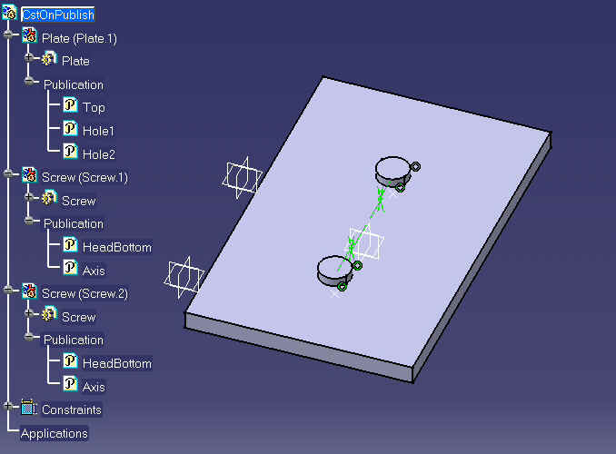
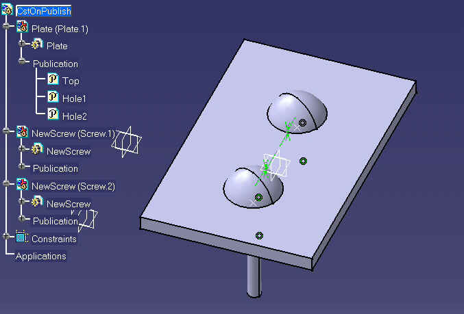

## 装配

### 在发布的元素上创建约束

本宏指南将向您展示如何在发布的元素上创建约束。

本宏会打开一个名为 `CAAAsmCstOnPublish.CATProduct` 的文档，该文档包含两个零件：一个底板（`Plate.CATPart`）和两个螺钉实例（`Screw.CATPart`）。它会在每个 `Product` 对象上检索与发布元素相对应的 `Publication`（发布）对象，这些发布的元素标识了例如底板上孔的位置和螺钉的轴线。宏会创建 `Constraint`（约束）对象来定位这些元素之间的相对位置。然后，它使用 `Products` 集合的 `ReplaceComponent` 方法将 `Screw.CATPart` 替换为 `NewScrew.CATPart`，并自动重新连接新零件中已发布元素上的约束。

`CAAAsmCstOnPublish` 在 CATIA [1] 中启动。无需事先打开任何文档。
`CAAAsmCstOnPublish.CATScript` 位于 `CAAScdArrUseCases` 模块中。执行宏（仅限 Windows 系统）。

---

### CAAAsmCstOnPublish 包含以下步骤：

1. 前期准备 (Prolog)
2. 创建约束
3. 用另一个螺钉替换当前螺钉

---

### 1. 前期准备 (Prolog)

宏首先加载 `CAAAsmCstOnPublish.CATProduct`，该产品包含两个零件：`Plate.CATPart` 和 `Screw.CATPart`（已为其创建了两个实例：`Screw.1` 和 `Screw.2`）。
这些对象利用 CATIA V5 的发布（Publication）功能，通过稳定的名称将其部分元素公开。底板将其顶面发布为 "**Top**"，将两个孔的中心点发布为 "**Hole1**" 和 "**Hole2**"。螺钉将其头部的底面发布为 "**HeadBottom**"，将其轴线发布为 "**Axis**"。

```vb
  ...' --------------------------
  ' 获取不同的产品 (Products)
  ' --------------------------
  Dim oRootProduct As Product
  Set oRootProduct=CATIA.ActiveDocument.Product
  
  Dim oPlate As Product
  Set oPlate = CATIA.ActiveDocument.Product.Products.Item  ( "Plate.1" ) 
  
  Dim oScrew1 As Product
  Set oScrew1 = CATIA.ActiveDocument.Product.Products.Item  ( "Screw.1" ) 
  
  Dim oScrew2 As Product
  Set oScrew2 = CATIA.ActiveDocument.Product.Products.Item  ( "Screw.2" ) 
   ...

```

加载新的产品文档后，声明 `oPlate`、`oScrew1` 和 `oScrew2` 变量以接收底板的实例和螺钉的两个实例。这些实例是通过它们的名称在根产品 (Root Product) 的 `Products` 集合中获取的。

此外还声明了其他变量 `oPlatePub`、`PlateRef`、`oScrewPub` 和 `oScrewRef`，它们将在下文中用于接收底板和螺钉的发布对象以及其底层的发布元素。这些已发布的元素将作为 `Reference`（引用）对象进行处理。

[回到顶部]

---

### 2. 创建约束

```vb
...' --------------------------------------
' 在底板的顶面和螺钉头部的底面之间创建偏移约束 (offset constraint)
' --------------------------------------
set oPlatePub = oPlate.Publications.Item("Top")
Set oPlateRef = oPlatePub.Valuation

'  ---> Plate/Top Screw1/HeadBottom 
Set oScrewPub = oScrew1.Publications.Item("HeadBottom")
Set oScrewRef = oScrewPub.Valuation

Dim oConstraint1 As Constraint
Set oConstraint1 = oConstraints0.AddBiEltCst  ( catCstTypeDistance, oPlateRef, oScrewRef ) 

oConstraint1.Dimension.Value = 2.000000
oConstraint1.Orientation = catCstOrientOpposite
...

```

对应于底板顶面的 `Publication` 对象是通过其名称 "**Top**" 在 `oPlate` 产品对象的 `Publications` 集合中获取的。随后，通过 `Publication` 对象的 `Valuation` 方法获得底层已发布对象的引用 (Reference)。我们以相同的方式处理螺钉头部的底面。

利用这两个引用，通过 `Constraints` 集合的 `AddBiEltCst` 方法创建一个偏移约束（offset constraint）。`AddBiEltCst` 用于创建涉及两个元素的约束，将第一个参数赋值为 `catCstTypeDistance` 会在作为第二个和第三个参数传入的两个对象之间创建一个距离（或偏移）约束。约束类型在 `CatConstraintType` 枚举中定义。

对生成的 `Constraint` 对象使用 `Dimension` 方法来指定距离的值（此处为 2 mm），而 `Orientation` 方法允许指定第二个几何元素相对于第一个元素的朝向。约束的朝向在 `CatConstraintOrientation` 枚举中定义。

以相同的方式创建了另外三个约束：底板顶面与第二个螺钉底面之间的偏移约束，以及每个螺钉的轴线与底板上对应孔的中心之间的重合约束。

```vb
...' --------------------------------------
' 更新产品 (Product) ..
' --------------------------------------
oRootProduct.Update
...

```

随后更新根产品，使零件移动到符合新创建约束条件的位置，得出以下结果。



```vb
...
MsgBox "Click OK to replace the screw by another standard screw ..." 
...

```

此时会显示一个消息框，允许您在继续操作之前查看中间结果。在 Unix 系统上，该结果仅在宏结束时可见。

[回到顶部]

---

### 3. 用另一个螺钉替换当前螺钉

```vb
...' --------------------------------------
' 用另一个螺钉替换该螺钉：在已发布元素上的约束会被自动重新连接 ...
' --------------------------------------
Set oScrew1 = oRootProduct.Products.ReplaceComponent ( _
      oScrew1,                                                         _
      sDocPath & "\online\CAAScdAsmUseCases\samples\NewScrew.CATPart", _
      True)

' --------------------------------------
' 使用新零件更新产品 (Product)
' --------------------------------------
oRootProduct.Update 
  ...

```

根产品 `Products` 集合中的 `ReplaceComponent` 方法允许将 `oScrew1` (`Screw.CATPart`) 的参考产品的所有实例替换为一个新参考产品的实例，新参考产品的完整路径将作为第二个参数传入（此处为 `NewScrew.CATPart`）。

所有在已发布元素上的约束都将被自动重新连接，并且更新根产品会自动在装配体中对新实例进行定位：



[回到顶部]

---

### 简而言之

本用例展示了如何使用宏在已发布的元素上创建和使用约束。