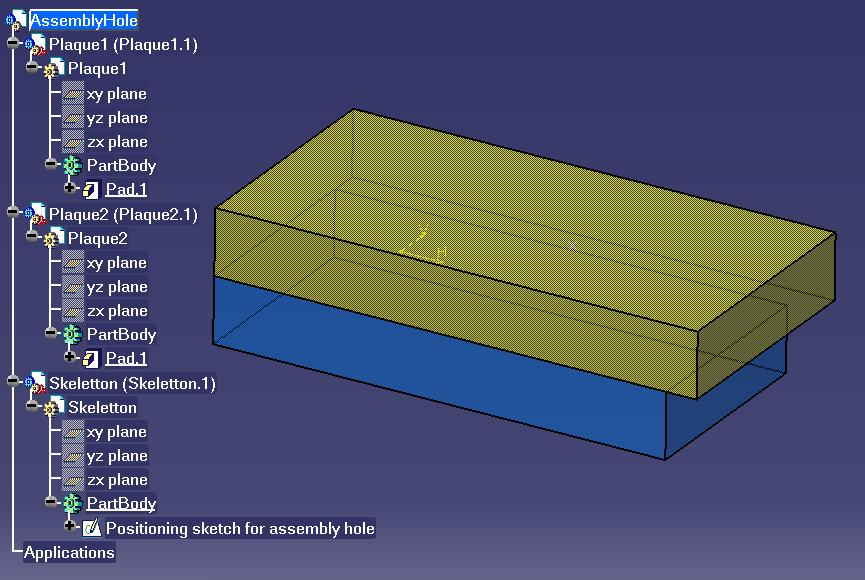
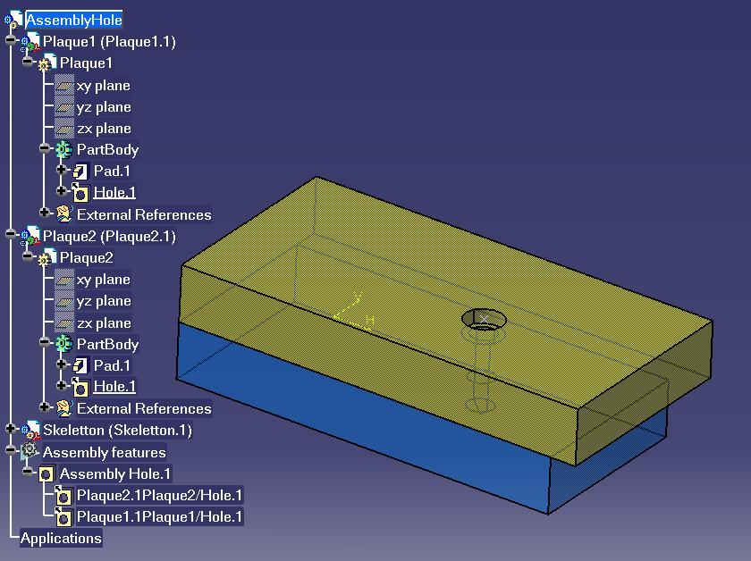

## 装配

### 创建和修改装配孔

本宏指南将向您展示如何创建一个装配孔并对其参数进行赋值。

本宏会打开一个名为 `AssemblyHole.CATProduct` 的文档，该文档包含三个零件：一个骨架模型 `Skeletton.CATPart`，以及两个底板 `Plaque1.CATPart` 和 `Plaque2.CATPart`。
它会检索与装配体中产品实例相对应的每个 `Product` 对象，以及用于定义装配孔位置的 `Sketch`（草图）对象。接着，它在装配体中创建一个 `AssemblyHole`（装配孔）对象，并设置这个新 `AssemblyHole` 对象的主要参数。最后，将更新整个装配体。

`CAAAsmCreateAssyHole` 在 CATIA [1] 中启动。无需事先打开任何文档。
`CAAAsmCreateAssyHole.CATScript` 位于 `CAAScdAsmUseCases` 模块中。执行宏（仅限 Windows 系统）。

---

### CAAAsmCreateAssyHole 包含以下步骤：

1. 前期准备 (Prolog)
2. 创建装配孔
3. 设置装配孔参数

---

### 1. 前期准备 (Prolog)

宏首先加载 `AssemblyHole.CATProduct`，该产品包含三个零件：一个骨架模型 `Skeletton.CATPart`，以及两个底板 `Plaque1.CATPart` 和 `Plaque2.CATPart`。


```vb
...' --------------------------
' 获取不同的产品 (Products)
' --------------------------
Dim oRootProduct As Product
Set oRootProduct = CATIA.ActiveDocument.Product

Dim oSkeletton As Product
Set oSkeletton = oRootProduct.Products.Item  ( "Skeletton.1" ) 

Dim oPlaque1 As Product
Set oPlaque1 = oRootProduct.Products.Item  ( "Plaque1.1" ) 

Dim oPlaque2 As Product
Set oPlaque2 = oRootProduct.Products.Item  ( "Plaque2.1" ) 
...

```

加载产品文档后，声明了 `oSkeletton`、`oPlaque1` 和 `oPlaque2` 变量，以接收 Skeletton、Plaque1 和 Plaque2 的实例。这些实例是通过它们的名称在根 `Product` [2] 的 `Products` 集合 [2] 中获取的。

```vb
...' -----------------------------------------
' 获取用于装配孔定位的草图 
' -----------------------------------------
Dim oSkelDocument As PartDocument
Set oSkelDocument = CATIA.Documents.Item("Skeletton.CATPart")

Dim oBody As Body
Set oBody = oSkelDocument.Part.Bodies.Item("PartBody")

Dim oPosSketch As Sketch
Set oPosSketch = oBody.Sketches.Item("Positioning sketch for assembly hole")
...

```

`oPosSketch` 对象将用于确定孔的定位点。该草图只需包含一个点即可。

[回到顶部]

---

### 2. 创建装配孔

```vb
...' -----------------------------------------
' 获取 AssemblyFeatures（装配特征）技术对象
' -----------------------------------------
Dim oAssemblyFeatures As AssemblyFeatures
Set oAssemblyFeatures = oRootProduct.GetTechnologicalObject("AssemblyFeatures")

' -------------------------------------------------------------
' 创建装配孔
'   定位草图 : oPosSketch
'   包含定位草图的实例 : oSkeletton
'   定义孔定位的实例 : oSkeletton
'   深度 : 10 mm
' -------------------------------------------------------------
Dim oAssemblyHole As AssemblyHole
Set oAssemblyHole = oAssemblyFeatures.AddAssemblyHole(oPosSketch, oSkeletton, 10.000000, oSkeletton)

' ------------------------------------------------------------
' 将零件关联至该装配孔 : Plaque1.1 和 Plaque2.1
' ------------------------------------------------------------
oAssemblyHole.AddAffectedComponent oPlaque1
oAssemblyHole.AddAffectedComponent oPlaque2
...

```

使用 `GetTechnologicalObject` 方法从根 `Product` 中检索 `AssemblyFeatures` 集合 [2] `oAssemblyFeatures`。此对象允许您检索 `oRootProduct` 的所有装配特征，并创建新的装配特征。

使用 `AddAssemblyHole` 方法创建一个新的 `AssemblyHole` 对象 [2]。
第一个和第二个参数定义了定位草图（`Sketch` [2]）以及包含该草图的 `Product`；它可以是 `Skeletton.CATPart` 的任意实例。第三个参数是以双精度浮点数形式表示的孔深度。第四个参数是 `Skeletton.CATPart` 的一个 `Product` 实例，它定义了装配上下文中孔的实际位置。

最后使用 `AddAffectedComponent` 方法，将 `Plaque1.1` 和 `Plaque2.1` 这两个产品声明为受该装配孔影响的组件。

[回到顶部]

---

### 3. 设置装配孔参数

```vb
...' --------------------------------------------
' 修改孔参数
'   - 直径 10 mm
'   - 沉头孔 (counterbored)
'   - V型底 (V-bottom)
'   - 长度
' --------------------------------------------
Dim oDiameter As Length
Set oDiameter = oAssemblyHole.Diameter
oDiameter.Value = 10.000000

oAssemblyHole.Type = catCounterboredHole
oAssemblyHole.AnchorMode = catExtremPointHoleAnchor

Dim oHeadDiameter As Length
Set oHeadDiameter = oAssemblyHole.HeadDiameter
oHeadDiameter.Value = 15.000000

Dim oHeadDepth As Length
Set oHeadDepth = oAssemblyHole.HeadDepth
oHeadDepth.Value = 5.000000

Dim oBottomLimit As Limit
Set oBottomLimit = oAssemblyHole.BottomLimit
oBottomLimit.LimitMode = catOffsetLimit

Dim oDepth As Length
Set oDepth = oBottomLimit.Dimension
oDepth.Value = 30.000000

oAssemblyHole.BottomType = catVHoleBottom

Dim oBottomAngle As Angle
Set oBottomAngle = oAssemblyHole.BottomAngle
oBottomAngle.Value = 120.000000
...

```

孔的直径通过 `Diameter` 属性和 `Length` 对象 [2] 进行设置。
孔的类型通过 `Type` 属性设置；孔的类型定义在 `CatHoleType` 枚举 [2] 中。由于这是一个沉头孔 (counterbored hole)，其锚点模式由 `AnchorMode` 设定；孔的锚点模式定义在 `CatHoleAnchorMode` 枚举 [2] 中。沉头部的深度和直径则分别通过 `HeadDepth`、`HeadDiameter` 属性及 `Length` 对象进行赋值。

其界限（深度限制）由 `BottomLimit` 属性和 `Limit` 对象 [2] 定义。

```vb
...' --------------------------------------
' 更新产品 (Product)
' --------------------------------------

oRootProduct.Update 
...

```

随后更新根 `Product`；它会将更新动作传递到所有受影响的零件，从而使生成的孔显示在各自的 CATPart 中。


[回到顶部]

---

### 简而言之

本用例展示了如何使用宏创建装配孔并对其参数进行设置。