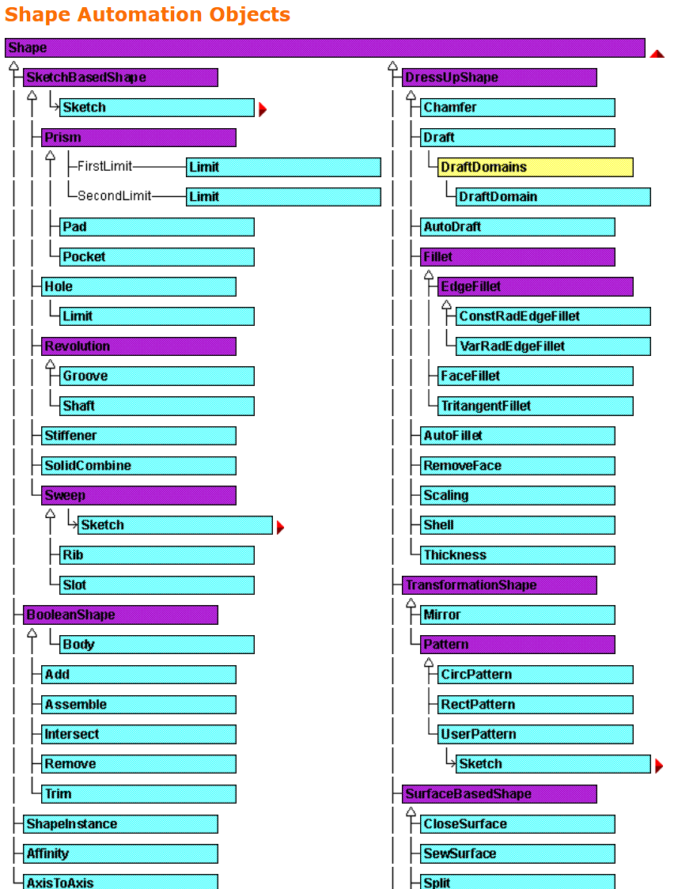
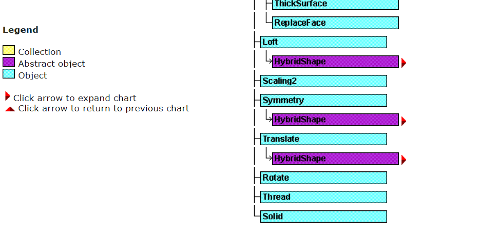

形状（特征）被分为以下几类：基于草图构建的（例如凸台或孔）；代表布尔运算的（例如分割或相交）；用于修饰基于草图形状的（例如圆角或倒角）；最后是对原始形状进行变换的——这里的“变换”指的是复制（例如镜像和阵列）。

基于草图的形状显然依赖于草图，`Sketch` 属性用于设置或检索与该形状相关联的草图。`Prism` 抽象对象整合了 `Pad`（凸台）和 `Pocket`（凹槽）对象的属性与方法。