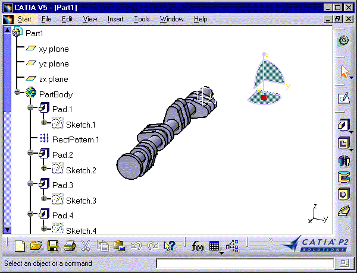
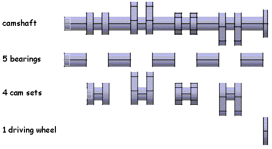
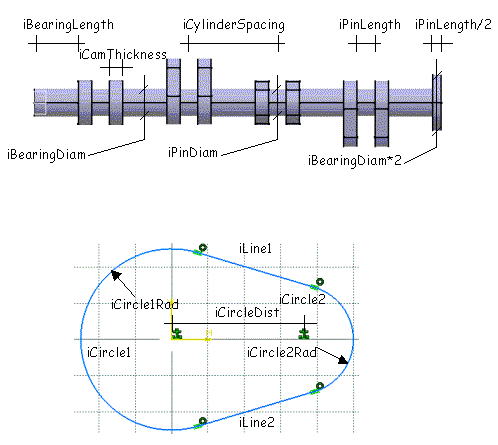
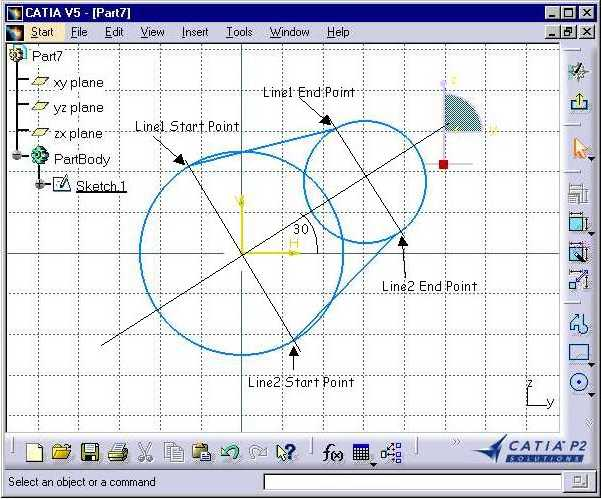
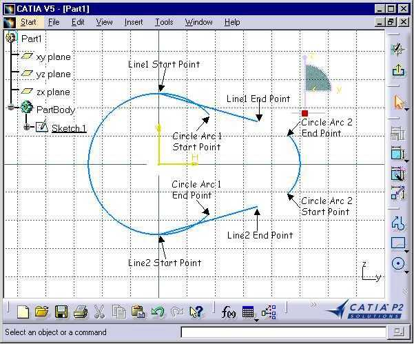
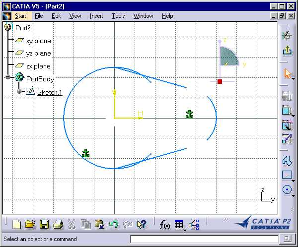
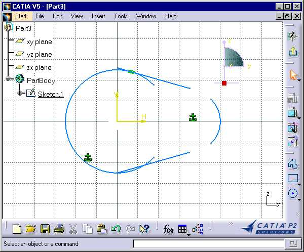
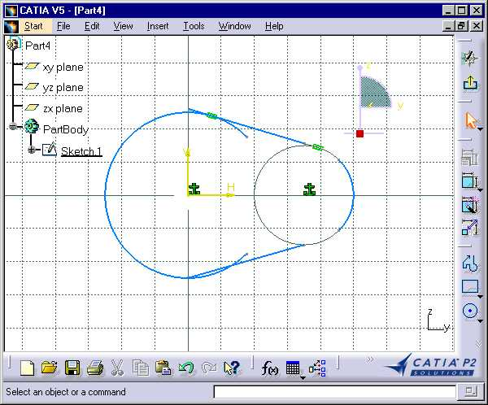
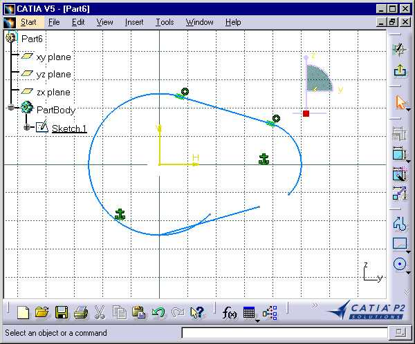
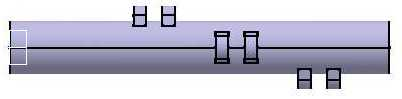

## 零件接口

### 创建简化的凸轮轴

本宏指南向您展示了如何使用零件设计（Part Design）的脚本编写功能创建一个简化的凸轮轴。
它允许您为四缸发动机创建凸轮轴。该宏使用了凸台（Pad）、阵列（Pattern）、草图（Sketch）以及约束（Constraint）对象的功能。它还展示了如何组织一个带有主程序的宏，以及如何创建可被多次调用的子程序（Sub）。创建的简化凸轮轴如下所示：


凸轮轴由五个轴承（bearings）、四组凸轮（cam sets）和一个驱动轮（driving wheel）组成。


轴承由一个凸台和复制该凸台的阵列构成。每组凸轮由两个相同的凸轮组成，中间由销轴（pin）隔开。各组凸轮围绕凸轮轴轴线分别旋转 90 度。驱动轮是一个简单的圆柱体。

`CAAPriCreateCamshaft` 在 CATIA [1] 中启动。无需打开任何文档。
`CAAPriCamshaft.CATScript` 位于 `CAAscdPriUseCases` 模块中。执行宏。
`CAAPriCreateCamshaft` 包含六个步骤：

1. 前期准备 (Prolog)
2. 主程序
3. 创建轴承
4. 创建凸轮组
5. 创建凸轮
6. 创建两个凸轮之间的销轴以及驱动轮

---

### 1. 前期准备 (Prolog)

```vb
...
'Number Of Cylinders (气缸数量)
' ------------------
   Dim iNumberOfCylinders As Integer
      
' Shaft data (轴数据)
' ----------
    ' -- Shaft origin (轴原点)
    Dim iCenterX As Integer
    Dim iCenterY As Integer

    ' -- Distance between two cams of two different cylinders (不同气缸的两个凸轮之间的距离)
    Dim iCylinderSpacing As Integer

    ' -- Bearing diameter (轴承直径)
    Dim iBearingDiam As Integer

    ' -- Distance between the cylinders centers (气缸中心之间的距离)
    Dim iBearingLength As Integer

    ' -- Pin diameter between two cams (两个凸轮之间的销轴直径)
    Dim iPinDiam As Integer

    ' -- Distance between 2 cams of a single cylinder (同一气缸的两个凸轮之间的距离)
    Dim iPinLength As Integer

' Cam data (凸轮数据)
' --------
    ' -- Thickness (厚度)
    Dim iCamThickness As Integer

    ' -- Circle 1 radius (圆1半径)
    Dim iCircle1Rad As Integer

    ' -- Circle 2 radius (圆2半径)
    Dim iCircle2Rad As Integer

    ' -- Distance between the 2 circle centers (两个圆心之间的距离)
    Dim iCircleDist As Integer

' Pi definition (Pi定义)
' -------------
    Dim dPi As Double

' Global data to define the different elements of the camshaft (定义凸轮轴不同元素的全局数据)
' ------------------------------------------------------------
    ' -- Cam Sketch and cam Sketch elements (凸轮草图及其元素)
    Dim oCurrentSketch  As Sketch
    Dim oCurrentLine1   As AnyObject
    Dim oCurrentLine2   As AnyObject
    Dim oCurrentCircle1 As AnyObject
    Dim oCurrentCircle2 As AnyObject
    
    ' -- Current distance from shaft origin (距轴原点的当前距离)
    Dim iCurrentLevel As Integer

' Part definition (零件定义)
' ---------------
     
    ' -- Part (零件)
    Dim oPart As Part

    ' -- Main tool of the part (零件的主实体)
    Dim oPartBody As Body

    ' -- Definition of YZ plane as work plane (定义YZ平面为工作平面)
    Dim oPlaneYZ As Reference
...

```

宏的这一部分定义了计算凸轮轴所需的数据。它包含了创建轴承、凸轮和驱动轮的参数，以及为了避免多次重新声明而在不同 Sub 中被重用的对象，还有 Part 的主要对象：`Part`、`PartBody` 和 YZ 平面。下面是这些参数在凸轮轴图纸和凸轮草图上的图解。



凸轮的草图轮廓由两个圆弧和两条线段组成。通过设置约束来固定圆、使线段与圆相切，并使圆弧与线段的端点重合。

---

### 2. 主程序

```vb
...
Sub CATMain()

    ' -- Initialize global variables (初始化全局变量)
    iNumberOfCylinders = 4
    iCamThickness      = 15
    iCircle1Rad        = 25
    iCircle2Rad        = 15                               
    iCircleDist        = 35                               
    iCenterY           = 0
    iCenterX           = 0
    iCylinderSpacing   = 100
    iPinDiam           = 15                                           
    iPinLength         = 20                                         
    iBearingDiam       = 32
    iBearingLength     = iCylinderSpacing - iPinLength - 2*iCamThickness
    dPi                = 3.14159265358979323846
    iCurrentLevel      = 0

    Dim oPartDocument As Document
    Set oPartDocument = CATIA.Documents.Add ( "Part" )
    Set oPart         = oPartDocument.Part
    Set oPartBody     = oPart.MainBody 
    Set oPlaneYZ      = oPart.CreateReferenceFromGeometry( _
                                          oPart.OriginElements.PlaneYZ )
    
    ' -- Shading view Mode (着色视图模式)
    CATIA.ActiveWindow.ActiveViewer.RenderingMode = 1

    msgbox "Create Five Bearings"
    Call CreatePatternBearing()
    oPart.Update
    CATIA.ActiveWindow.ActiveViewer.Reframe

    msgbox "Create First Cam Set"
    Call CreateCamSet (0) 
    oPart.Update 
    CATIA.ActiveWindow.ActiveViewer.Reframe

    msgbox "Create Second Cam Set"
    Call CreateCamSet (90)
    oPart.Update
    CATIA.ActiveWindow.ActiveViewer.Reframe

    msgbox "Create Third Cam Set"
    Call CreateCamSet (180)
    oPart.Update
    CATIA.ActiveWindow.ActiveViewer.Reframe

    msgbox "Create Fourth Cam Set"
    Call CreateCamSet (270)
    oPart.Update
    CATIA.ActiveWindow.ActiveViewer.Reframe

    msgbox "Create Driving Wheel"
    Call CreateCylinder (iPinLength/2, iBearingDiam )
    oPart.Update
    Catia.ActiveWindow.ActiveViewer.Reframe 

    msgbox "This is the macro end"

End Sub       
...

```

主程序初始化了各项参数（长度均以毫米为单位初始化），并调用了不同的 Sub 程序：

* `CreatePatternBearing`：用于创建将凸轮组和驱动轮连接起来的圆柱体形式的轴承。
* 四次调用 `CreateCamSet`：分别使用不同的角度值（0、90、180 和 270 度）创建每个凸轮组。一组凸轮由两个凸轮和连接它们的销轴组成。`CreateCamSet` 内部又会调用其他的 Sub。
* `CreateCylinder`：用于创建驱动轮。它也被 `CreateCamSet` 调用以创建销轴。

主程序在执行每项任务前都会使用 `msgbox` 函数提示您将要执行的任务，并在任务完成后更新零件以计算结果几何体，然后在提示您下一个任务之前重新调整显示范围（Reframe）。
在这些参数中，请注意 `iCurrentLevel`，它在整个宏中被用来记录沿凸轮轴轴线的当前横坐标位置。

[回到顶部]

---

### 3. 创建轴承

```vb
...
Sub CreatePatternBearing()

  ' Cylinder definition: Pad from a circular sketch (圆柱体定义：由圆形草图生成的凸台)
  ' -----------------------------------------------
    
    ' -- The YZ plane is the sketch plane (YZ平面为草图平面)
    Set oCurrentSketch = oPartBody.Sketches.Add ( oPlaneYZ )
        
    ' -- The sketch is a circle centered on the shaft origin (草图是以轴原点为中心、直径为 iBearingDiam 的圆)
    ' --  and of iBearingDiam diameter
    Dim oFactory2D as Factory2D
    Set oFactory2D = oCurrentSketch.OpenEdition 
    Set oCurrentCircle1 = oFactory2D.CreateClosedCircle ( iCenterX, _
                                                          iCenterY, _
                                                          iBearingDiam/2 ) 
    oCurrentSketch.CloseEdition 
       
    ' Creation of the cylindrical pad (创建圆柱形凸台)
    Dim oPad As Pad
    Set oPad = oPart.ShapeFactory.AddNewPad ( oCurrentSketch,  iBearingLength )

...

```

需要进行阵列的凸台是一个通过草图定义的圆柱体。首先，将草图作为一个空对象添加到草图集合中。然后，在调用 `OpenEdition` 和 `CloseEdition` 方法之间，使用草图对象包含的 2D 工厂（2D factory）对象对其进行编辑。借助 2D 工厂对象的 `CreateClosedCircle` 方法，该草图由 YZ 平面上的一个圆组成，其圆心为平面原点，半径为 `iBearingDiam/2`。随后，使用可通过零件对象自身获取的形状工厂（shape factory）对象的 `AddNewPad` 方法，使用该草图创建凸台。

```vb
...
  ' Creating the pattern (创建阵列)
  ' --------------------
             
    Dim originElements1 As OriginElements
    Set originElements1 = oPart.OriginElements

    Dim oRefPlaneXY As Reference
    Set oRefPlaneXY = oPart.CreateReferenceFromGeometry( _
                                                   oPart.OriginElements.PlaneXY )

    Dim rectPattern1 As RectPattern
    Set rectPattern1 = oPart.ShapeFactory.AddNewRectPattern(oPad,                 _
                                                            iNumberOfCylinders+1, _
                                                            1,                    _
                                                            iCylinderSpacing,     _
                                                            0.0,                  _
                                                            1,                    _  
                                                            1,                    _
                                                            oRefPlaneXY,          _
                                                            oRefPlaneXY,          _
                                                            True,                 _
                                                            True,                 _
                                                            0.0)

    ' -- Update of the current level (更新当前层级)
    iCurrentLevel =  iBearingLength

End Sub
...

```

凸台创建完毕后，就可以利用形状工厂对象的 `AddNewRectPattern` 方法创建矩形阵列来进行复制。阵列参数如下：

* `oPad`：要进行阵列的特征。
* `iNumberOfCylinders+1` 和 `1`：分别沿阵列第一和第二方向的实例数量，此处分别为 5 和 1。
* `iCylinderSpacing` 和 `0.0`：分别沿第一和第二方向上各个实例之间的间距。由于在第二方向上只有一个凸台实例，因此间距设置为 0。
* `1` 和 `1`：初始凸台在两个方向阵列生成的实例中的位置。
* `oRefPlaneXY` 和 `oRefPlaneXY`：分别为阵列的第一和第二方向。两次引用 XY 平面意味着第一方向为 X 轴，第二方向为 Y 轴。为此，必须将该平面作为参考（Reference）对象传递。这就是为什么对 `OriginElements` 对象的 XY 平面几何对象使用 `CreateReferenceFromGeometry` 的原因。
* `True` 和 `True`：标志位，指示是否应保持上述方向方位原样，还是将其反转。
* `0.0` 是在阵列之前应用于两个方向的角度，单位为度。

最后，将凸台顶部的横坐标赋给 `iCurrentLevel` 作为参考：下一个凸台将在它的基础上创建。

---

### 4. 创建凸轮组

```vb
...
Sub CreateCamSet(angle)

    ' -- Create the first cam (创建第一个凸轮)
    CreateCam(angle)
    iCurrentLevel = iCurrentLevel + iCamThickness

    ' -- Create a cylinder for the pin between cams (为凸轮间的销轴创建一个圆柱体)
    Call CreateCylinder(iPinLength, iPinDiam)

    ' -- Create the second cam (创建第二个凸轮)
    CreateCam(angle)

    ' -- Update the current level (更新当前层级)
    iCurrentLevel = iCurrentLevel + iCamThickness + iBearingLength

End Sub
...

```

`CreateCamSet` 根据其围绕轴的 `angle`（角度）创建凸轮组。它依次调用 `CreateCam`、`CreateCylinder` 并再次调用 `CreateCam`，分别创建第一个凸轮、组内两个凸轮之间的销轴以及第二个凸轮。在两次调用 `CreateCam` 后都会更新 `iCurrentLevel` 以正确定位下一个对象。`CreateCylinder` 则会在其内部自行更新该值。

---

### 5. 创建凸轮

```vb
...
Sub CreateCam(angle)
    
    Dim dRad As Double
    dRad = angle*dPi/180
  
    Dim dDSin1 as Double
    dDSin1 = iCircle1Rad*sin(dRad)

    Dim dDCos1 as Double
    dDCos1 = iCircle1Rad*cos(dRad)
    
    Dim dDSin2 as Double
    dDSin2 = iCircle2Rad*sin(dRad)

    Dim dDCos2 as Double
    dDCos2 = iCircle2Rad*cos(dRad)
    
    Dim dCSin  as Double
    dCSin  = iCircleDist*sin(dRad)

    Dim dCCos  as Double
    dCCos  = iCircleDist*cos(dRad)
...

```

代码的第一部分将作为参数传入的 `angle`（度）转换为弧度 `dRad`，并创建一些变量用于计算圆弧和线段端点的坐标。这些端点并不打算直接精确构建凸轮轮廓，而是提供一个大致轮廓。随后，圆弧和线段将被施加约束，从而生成实际的凸轮轮廓。我们来看看几何对象的创建过程：

```vb
...
  ' Create a sketch (创建草图)
  ' ---------------
    Set oCurrentSketch = oPartBody.Sketches.Add ( oPlaneYZ ) 

  ' Create geometric elements in the sketch (在草图中创建几何元素)
  ' ---------------------------------------
    Dim oFactory2D As Factory2D
    Set oFactory2D = oCurrentSketch.OpenEdition

    Set oCurrentLine1   = oFactory2D.CreateLine   ( _
                     iCenterX - dDSin1,          iCenterY + dDCos1, _
                     iCenterX + dCCos - dDSin2,  iCenterY + dCSin + dDCos2 )

    Set oCurrentLine2   = oFactory2D.CreateLine   ( _
                     iCenterX + dDSin1,          iCenterY - dDCos1, _
                     iCenterX + dCCos + dDSin2,  iCenterY + dCSin - dDCos2 )
...

```

使用 `Add` 方法创建草图并将其添加到零件实体的草图集合中，该方法指定 YZ 平面为草图平面。然后通过调用其返回 2D 对象工厂的 `OpenEdition` 方法打开草图进行编辑。

接着，使用 2D 对象工厂的 `CreateLine` 方法创建第一条线段。前两个参数是线段起点在草图平面坐标系中的横纵坐标，后两个参数是终点的坐标。这些坐标值是通用的，适用于任何角度值。第二条线段以相同的方式创建。



这个草图展示了对于 30 度角，如何使用这些坐标来创建线条。它们的端点位于垂直于圆心连线方向的直径与圆相交的地方。此处显示的圆是支撑圆或圆弧。

```vb
...
    Dim dRad1 As Double
    dRad1 = dRad - dPi/4

    Dim dRad2 As Double
    dRad2 = dRad + dPi/4

    Set oCurrentCircle1 = oFactory2D.CreateCircle ( _
                     iCenterX,                   iCenterY, _
                     iCircle1Rad,   dRad2,    dRad1)

    Set oCurrentCircle2 = oFactory2D.CreateCircle ( _
                     iCenterX + dCCos,           iCenterY + dCSin, _
                     iCircle2Rad,   dRad1,    dRad2)
...

```

然后根据 `dRad` 加减 90 度（PI/4）计算出两个角度 `dRad1` 和 `dRad2`，作为圆弧的起始和终止角度。使用 2D 对象工厂的 `CreateCircle` 方法创建第一段圆弧。前两个参数是圆心在草图平面坐标系中的横纵坐标，第三个参数是圆的半径，最后两个参数分别是起始和终止角度（以弧度表示），用于定义圆弧的起点和终点。第二段圆弧以相同方式创建。在 0 度角时创建的实际几何对象如下所示。


如您所见，此时草图并没有闭合。接下来将对这些对象设置约束。但首先，必须从这些几何对象中获取 Reference（参考）对象，因为约束只能应用于 Reference 对象。

```vb
...
  ' Get references from elements to constraint (获取待约束元素的参考)
  ' ------------------------------------------

    Dim oRefLine1 As Reference
    Set oRefLine1 = oPart.CreateReferenceFromObject(oCurrentLine1)

    Dim oRefCircle1 As Reference
    Set oRefCircle1 = oPart.CreateReferenceFromObject(oCurrentCircle1)

    Dim oRefLine2 As Reference
    Set oRefLine2 = oPart.CreateReferenceFromObject(oCurrentLine2)

    Dim oRefCircle2 As Reference
    Set oRefCircle2 = oPart.CreateReferenceFromObject(oCurrentCircle2)

    Dim oRefLine1StartPt As Reference
    Set oRefLine1StartPt = oPart.CreateReferenceFromObject(oCurrentLine1.StartPoint)

    Dim oRefLine1EndPt As Reference
    Set oRefLine1EndPt = oPart.CreateReferenceFromObject(oCurrentLine1.EndPoint)

    Dim oRefLine2StartPt As Reference
    Set oRefLine2StartPt = oPart.CreateReferenceFromObject(oCurrentLine2.StartPoint)

    Dim oRefLine2EndPt As Reference
    Set oRefLine2EndPt = oPart.CreateReferenceFromObject(oCurrentLine2.EndPoint)

    Dim oRefCircle1StartPt As Reference
    Set oRefCircle1StartPt = _
        oPart.CreateReferenceFromObject(oCurrentCircle1.StartPoint)

    Dim oRefCircle1EndPt As Reference
    Set oRefCircle1EndPt = oPart.CreateReferenceFromObject(oCurrentCircle1.EndPoint)

    Dim oRefCircle2StartPt As Reference
    Set oRefCircle2StartPt = _
        oPart.CreateReferenceFromObject(oCurrentCircle2.StartPoint)

    Dim oRefCircle2EndPt As Reference
    Set oRefCircle2EndPt = oPart.CreateReferenceFromObject(oCurrentCircle2.EndPoint)
...

```

我们获得了两条线段、两条圆弧以及它们各自端点的 Reference 对象。现在可以设置约束了。

```vb
...
  ' Create constraints (创建约束)
  ' ------------------
    Dim oConstraints As Constraints
    Set oConstraints = oCurrentSketch.Constraints
    Dim oConstraint As Constraint

    ' -- Fix Circle1 (固定圆1)
    Set oConstraint = oConstraints.AddMonoEltCst(catCstTypeReference, oRefCircle1)

    ' -- Fix Circle2 (固定圆2)
    Set oConstraint = oConstraints.AddMonoEltCst(catCstTypeReference, oRefCircle2)

...

```

从草图中检索出约束集合，并创建一个当前约束对象，贯穿整个约束创建步骤使用。首先，通过 `AddMonoEltCst` 方法，将用于固定约束的 `catCstTypeReference` 约束类型和对圆的参考一同传入，将两条圆弧的两个支撑圆设置为不可修改（即它们不能移动，半径也不能改变）。这由相切符号表示。


```vb
...
' -- Tangency Line1 Circle1 (线1与圆1相切)
    Set oConstraint = oConstraints.AddBiEltCst(catCstTypeTangency, _
                                               oRefLine1,          _
                                               oRefCircle1)
...

```

借助 `AddBiEltCst` 方法，传入相切约束类型 `catCstTypeTangency`，以及对线段和圆弧的参考，在第一条线段和第一段圆弧之间设置相切约束。这由相切符号表示。


```vb
...
' -- Tangency Line1 Circle2 (线1与圆2相切)
    Set oConstraint = oConstraints.AddBiEltCst(catCstTypeTangency, _
                                               oRefCircle2,        _
                                               oRefLine1)
...

```

在第一条线段和第二段圆弧之间设置另一个相切约束。



```vb
...
' -- Coincidence Circle1 Start Point Line1 Start Point (圆1起点与线1起点重合)
    Set oConstraint = oConstraints.AddBiEltCst(catCstTypeOn,       _
                                               oRefCircle1StartPt, _
                                               oRefLine1StartPt)
...

```

借助 `AddBiEltCst` 方法，传入重合约束类型 `catCstTypeOn`，以及对线段端点和圆弧端点的参考，在第一条线段（的端点）和第一段圆弧（的端点）之间设置重合约束。这由重合符号表示。现在几何对象已被重新界定（relimited）。


```vb
...
' -- Coincidence Circle2 End Point Line1 End Point (圆2终点与线1终点重合)
    Set oConstraint = oConstraints.AddBiEltCst(catCstTypeOn,     _
                                               oRefCircle2EndPt, _
                                               oRefLine1EndPt)
...

```

在第一条线段和第二段圆弧之间设置另一个重合约束。

第一条线段现在连接并相切于两条圆弧。相同的原理应用于第二条线段。



```vb
...
' -- Tangency Line2 Circle1 (线2与圆1相切)
    Set oConstraint = oConstraints.AddBiEltCst(catCstTypeTangency, _ 
                                               oRefLine2,          _
                                               oRefCircle1)

    ' -- Tangency Line2 Circle2 (线2与圆2相切)
    Set oConstraint = oConstraints.AddBiEltCst(catCstTypeTangency, _
                                               oRefLine2,          _
                                               oRefCircle2)

    ' -- Coincidence Circle1 End Point Line2 Start Point (圆1终点与线2起点重合)
    Set oConstraint = oConstraints.AddBiEltCst(catCstTypeOn,     _
                                               oRefCircle1EndPt, _
                                               oRefLine2StartPt)

    ' -- Coincidence Circle2 Start Point Line2 End Point (圆2起点与线2终点重合)
    Set oConstraint = oConstraints.AddBiEltCst(catCstTypeOn,       _
                                               oRefCircle2StartPt, _
                                               oRefLine2EndPt)

    oCurrentSketch.CloseEdition 

  ' Create the Pad from the sketch (根据草图创建凸台)
  ' ------------------------------
    Dim oPad As Pad
    Set oPad = oPart.ShapeFactory.AddNewPad ( oCurrentSketch, _
                                              iCamThickness + iCurrentLevel )
    oPad.SecondLimit.Dimension.Value = iCurrentLevel*-1
    
End Sub
...

```

约束设置完毕后，关闭草图编辑，即可使用 `AddNewPad` 方法基于此草图创建凸台。

---

### 6. 创建两个凸轮之间的销轴以及驱动轮

它们都是由使用 `CreateCylinder` Sub 创建的简单圆柱体构成的，创建时需要将厚度（即圆柱体的高度）及其半径作为参数传入。

```vb
...
Sub CreateCylinder(thickness, radius)
    
    ' -- Create a sketch (创建草图)
    Set oCurrentSketch = oPartBody.Sketches.Add ( oPlaneYZ )

    ' -- Create base circle in the sketch (在草图中创建基准圆)
    Dim oFactory2D As Factory2D
    Set oFactory2D = oCurrentSketch.OpenEdition 
    Set oCurrentCircle1 = oFactory2D.CreateClosedCircle (iCenterX, iCenterY, radius) 
    oCurrentSketch.CloseEdition 

    ' -- Create the Pad from the sketch (根据草图创建凸台)
    Dim oPad As Pad
    Set oPad = oPart.ShapeFactory.AddNewPad ( oCurrentSketch, _
                                              iCurrentLevel + thickness )
    oPad.SecondLimit.Dimension.Value = iCurrentLevel*-1

    ' -- Increase Level (增加层级高度)
    iCurrentLevel = iCurrentLevel + thickness

End Sub
...

```

将草图添加到零件实体的草图集合中，并通过打开草图编辑获取 2D 工厂。使用传入的半径、以 YZ 平面坐标系原点为中心，借助 `CreateClosedCircle` 方法创建一个闭合圆。然后关闭草图编辑，并使用聚合到零件对象的形状工厂对象的 `AddNewPad` 方法创建凸台。它使用刚刚创建的草图，并将凸台高度设置为当前层级（current level）加上厚度。此时，创建的凸台从 YZ 平面一直延伸到 `iCurrentLevel + thickness` 的横坐标位置。这显然太长了。
凸台对象的 `SecondLimit` 属性可以调整凸台大小。我们将第二界限（second limit）尺寸对象的值设置为当前层级的相反数。第二界限的值沿着凸台拉伸轴的负横坐标方向计算为正值。这就是为什么要使用当前层级相反数的原因。这使得凸台的第二个面（即平行于草图的第二个面）与前一个实体的顶面（即最后一个轴承的面）平齐。下面两张截图显示了这两条连续的凸台创建指令的效果。

另一种编写代码的方式是：

```vb
...
    Dim oPad As Pad
    Set oPad = oPart.ShapeFactory.AddNewPad ( oCurrentSketch,  thickness )
    oPad.FirstLimit.Dimension.Value  = iCurrentLevel + thickness
    oPad.SecondLimit.Dimension.Value = iCurrentLevel*-1
...

```

这是一种更符合直觉的创建具有实际厚度凸台的方法，但它需要三条指令而不是两条。尽管凸台是按其实际厚度创建的，但它最初是从 YZ 平面延伸至等于厚度横坐标的点。随后才设定其第一界限，接着是第二界限。下面三张截图展示了这三条连续凸台创建指令的效果。


[回到顶部]

---

### 简而言之

本用例展示了如何使用零件接口（PartInterfaces）框架中的对象（即凸台 Pad 和阵列 Pattern 对象）来创建一个简化的凸轮轴。还使用了草图（Sketch）和约束（Constraint）对象来创建凸轮凸台所依赖的草图。展示了如何利用从几何对象中获取的参考（Reference）对象来创建阵列和约束。此外，该用例还展示了如何通过包含在宏执行期间可被多次调用的 Sub（子程序）来组织宏结构。